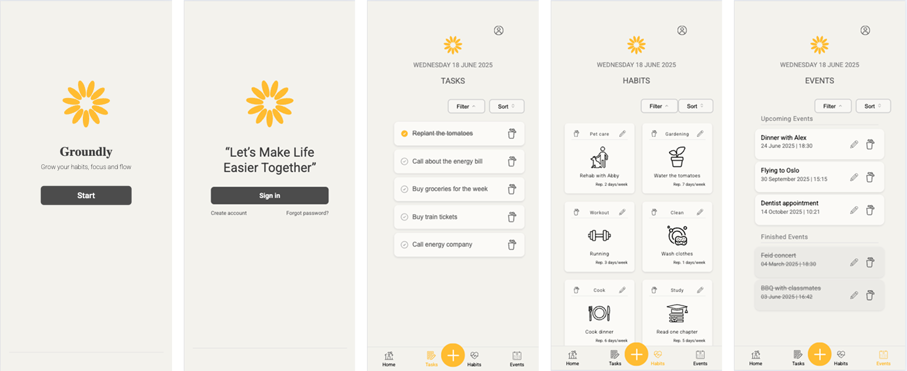
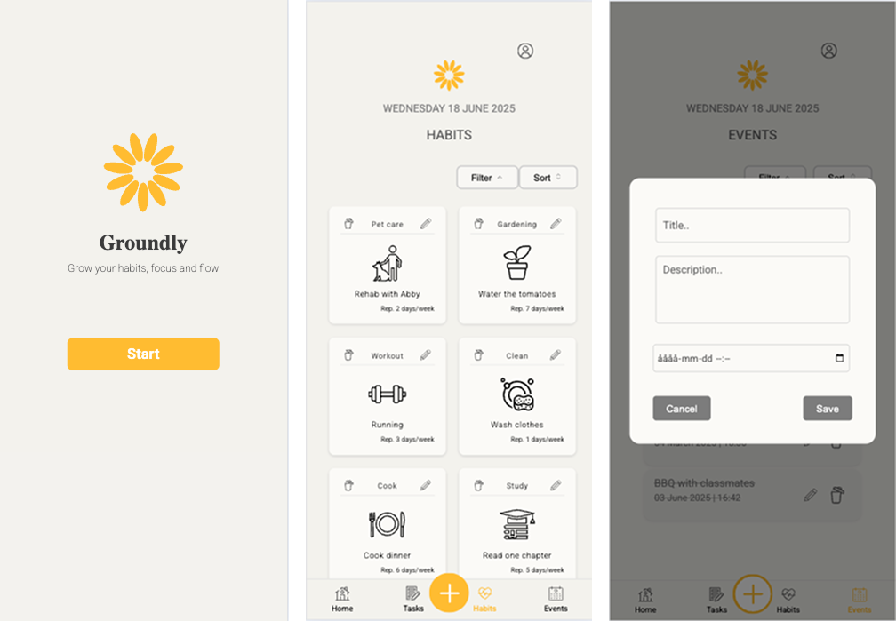

# productivity-application "Groundly"
Group project (Frontend projekt och agila metoder, Nackademin)

Figma - Mockup link : [https://www.figma.com/design/mTMoBTxp0BLautM1Ne4A1Q/Productivity-Assistant-Application---Frontend-projekt-och-agila-metoder?node-id=0-1&t=QAIRULMyS5KNamxN-1](https://www.figma.com/design/N1o6BlQy6jQfPHoTqdpj35/Productivity-App-Groundly?node-id=0-1&p=f&t=H71x3HH4OYlOwUDQ-0)

Live deploy: 
https://lo-river.github.io/productivity-app/

UPDATED: 

# Groundly – Productivity App

A simple productivity app built as a school project during my frontend developer studies at Nackademin (YH – Stockholm).  
The goal of this app is to help users build daily habits and stay focused using JavaScript. 

**Live Demo:** [https://lo-river.github.io/productivity-app/](https://lo-river.github.io/productivity-app/)  
 **GitHub Repo:** [https://github.com/Lo-river/productivity-app](https://github.com/Lo-river/productivity-app)

You can:
- Add new habits/tasks/events
- Mark them as “done”
- See an overview of your progress
- Use the app on both desktop and mobile (responsive design)

This was a group project focused on **HTML, CSS/SCSS, and JavaScript** – no frameworks or backend.

---

## Technologies Used

- HTML5 – semantic structure
- CSS3 / SCSS – styling and layout
- JavaScript (ES6) – logic and interactivity
- Git & GitHub – version control and collaboration
- GitHub Pages – deployment
- Figma – design planning 

---

## Screenshots

## Try it Yourself

You can use the app directly in your browser:

[Open Groundly Live](https://lo-river.github.io/productivity-app/)

## Folder Structure

/productivity-app
│
├── index.html
├── css/
│ └── main.css
├── js/
│ └── main.js
├── images/
│ └── [icons, logos, etc.]
├── scss/
│ └── [SCSS files if used]
└── README.md

## How to Run Locally

If you want to run the project on your own computer:

1. Clone the repo:
   git clone https://github.com/Lo-river/productivity-app.git
   cd productivity-app

2. Open `index.html` in your browser.

    No install or build tools needed – it’s a pure frontend project.

##  What I Learned

This project helped me practice:

- Creating a responsive layout with CSS
- Writing clean and modular JavaScript
- Using GitHub for version control
- Planning and structuring a simple app
- Working with agile methods
- Pair Programming, Mob Programming & Remote Pairing

Challenges I worked through:
- Handling empty states (no habits)
- Making the app responsive on mobile
- Organizing JavaScript into clean files
- Initial github conflicts 

## Ideas for Future Features

If I had more time, I would add:
- User login and personal dashboard
- Reminders or notifications
- Stats and tracking history
- Better animations and transitions
- Improve layout and accessibility
- Dark mode

## About Me

I'm currently studying to become a frontend developer at **Nackademin** (YH, Stockholm).  
I enjoy building simple, clean web apps and learning more about web development every day.

Feel free to reach out or check out my GitHub:
- GitHub: [https://github.com/Lo-river](https://github.com/Lo-river)
- Email: loriverinez.loof@yh.nackademin.se

